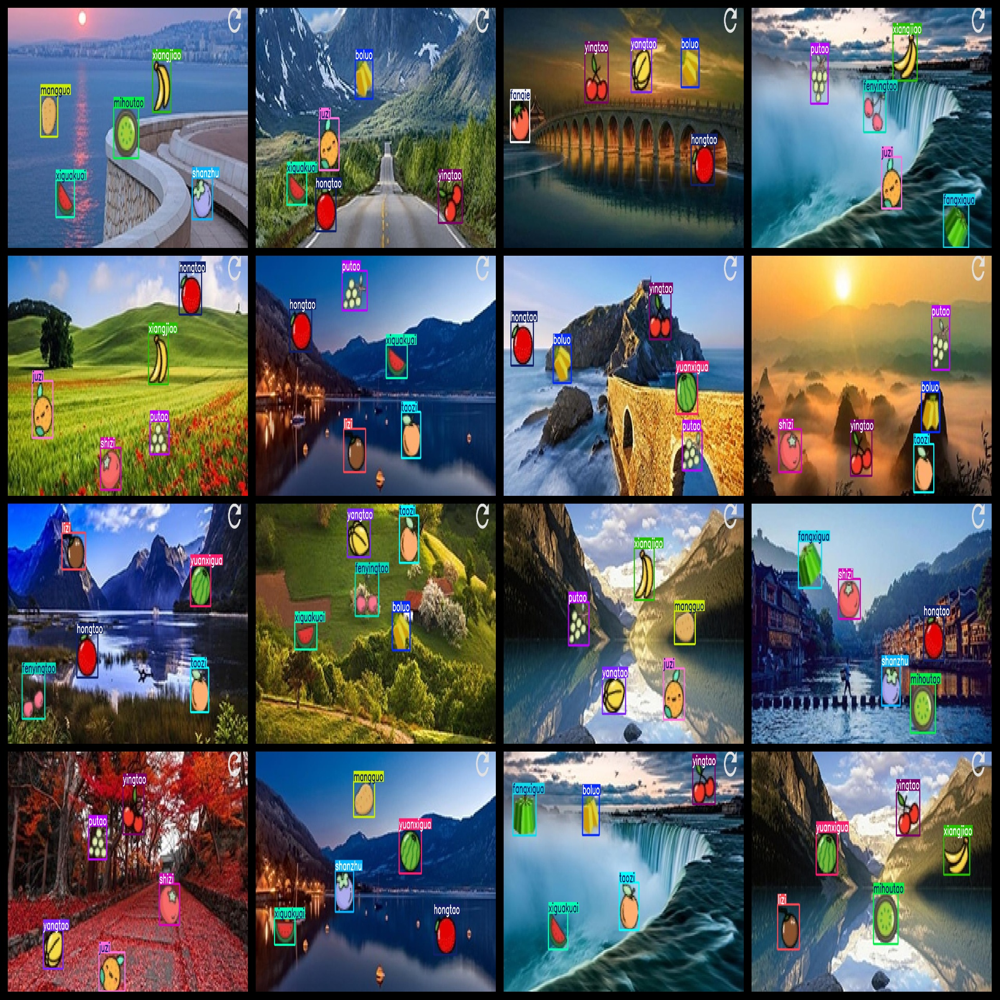
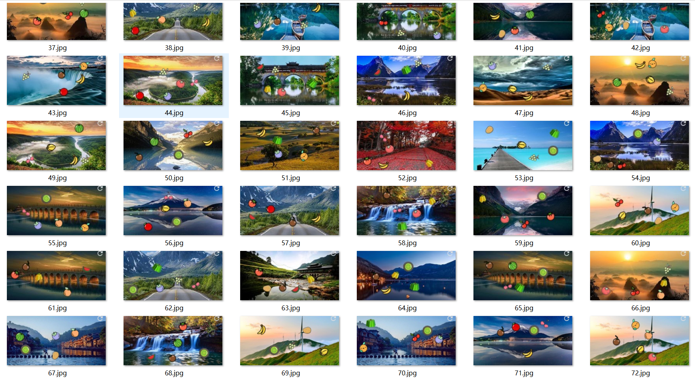
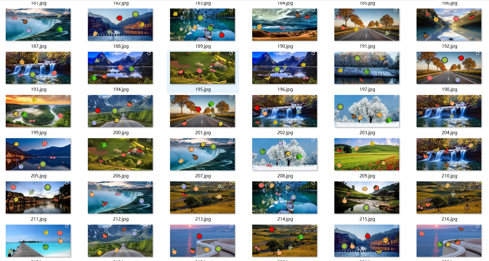

# [Dataset] Fruit Code Dataset 754 images18 typesFruit YOLO+VOC format

Dataset format: Pascal VOC format + YOLO format (the txt file does not contain the split path, it only contains jpg images and corresponding VOC format xml files and yolo format txt files)

Number of images (number of jpg files): 754

Number of annotations (number of xml files): 754

Number of annotations (number of txt files): 754

Number of categories: 18

Annotation class names: ["boluo","fangxigua","fanqie","fenyingtao","hongtao","juzi","lizi","mangguo","mihoutao","putao","shanzhu","shizi","taozi","xiangjiao","xiguakuai","yangtao","yingtao","yuanxigua"]

Number of boxes labeled in each category:

boluo frame count = 210

fangxigua frame count = 201

fanqie frame count = 192

fenyingtao frame count = 195

hongtao frame count = 212

juzi frame count = 215

lizi frame count = 212

mangguo frame count = 218

mihoutao frame count = 194

putao frame count = 211

shanzhu frame count = 210

shizi frame count = 190

taozi frame count = 206

xiangjiao frame count = 222

xiguakuai frame count = 246

yangtao frame count = 203

yingtao frame count = 218

yuanxigua frame count = 215

Total boxes: 3770

Use the labeling tool: labelImg

Rules for annotation: Draw a rectangle around the category.

Important Note: None

Special Notice: This dataset does not guarantee the accuracy or precision of the trained models or weight files. The dataset only provides accurate and reasonable annotations.

## Images

---

Here is a pay link on Stripe (https://buy.stripe.com/3cs8yP7sY87d0vu9AB). Please contact me lonlonago@foxmail.com after funding $89, and I will send you a complete data files, thank you!

